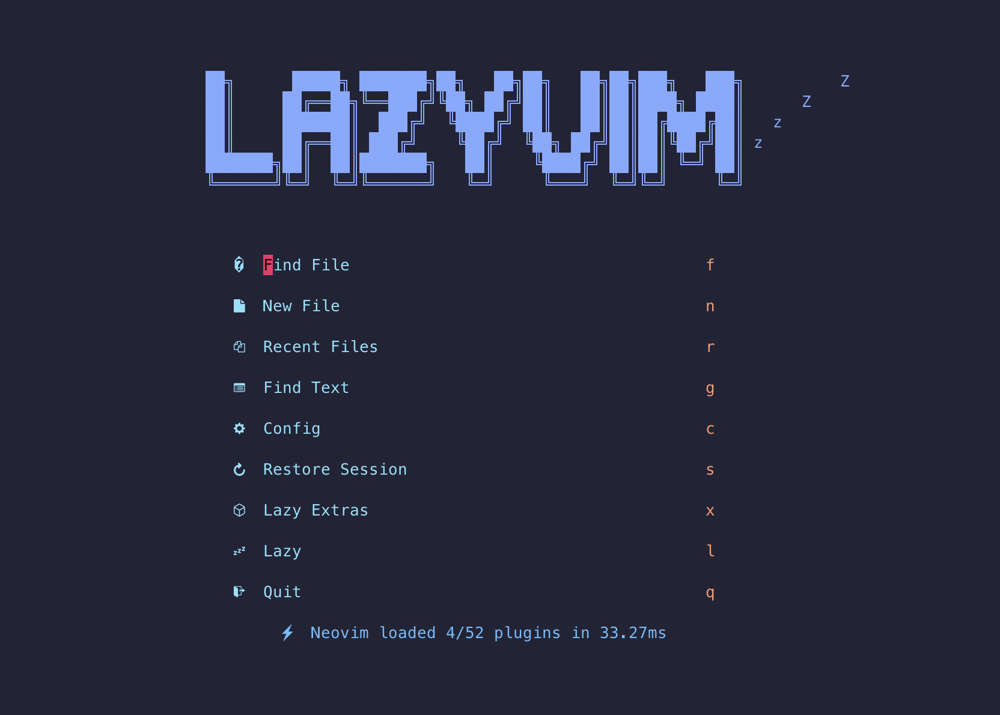
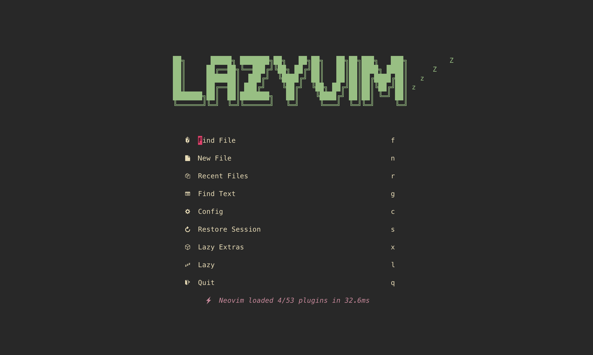

# LazyVim Introduction and Installation Guide

<div align="center">
  
</div>

## What is LazyVim?

LazyVim is a lightweight plugin for Vim that enhances productivity by providing convenient shortcuts and automations for common tasks. It aims to streamline the Vim experience for both beginners and advanced users, reducing the need for manual configuration and repetitive actions.

## Features

- **Efficient Navigation**: Navigate through files, directories, and codebase with ease.
- **Text Manipulation**: Perform text manipulation operations quickly and effortlessly.
- **Syntax Highlighting**: Enjoy syntax highlighting for various programming languages.
- **Customization**: Customize LazyVim to fit your workflow and preferences.

<div style="display: flex; flex-direction: row; align-items: center; justify-content: space-around;">
    <div style="text-align: center;">
        
        <p><b>LazyVim</b></p>
    </div>
    <div style="text-align: center;">
        
        <p><b>LazyVim_Gruvbox</b></p>
    </div>
</div>

# Setting Up MyLazyVim

To install LazyVim, follow these simple steps in [repos](https://github.com/tranlynhathao/LazyVim) or you can install it in the style of tranlynhathao into the configuration file .config/nvim/ on your local computer following these steps:

1. Navigate to the `.config/nvim/` directory:
   ```bash
   cd .config/nvim/
   ```

2. Clone the MyLazyVim repository from GitHub:
   ```bash
   git clone https://github.com/tranlynhathao/MyLazyVim.git
   ```

## Note: Make sure you have Neovim installed before proceeding with these steps.


